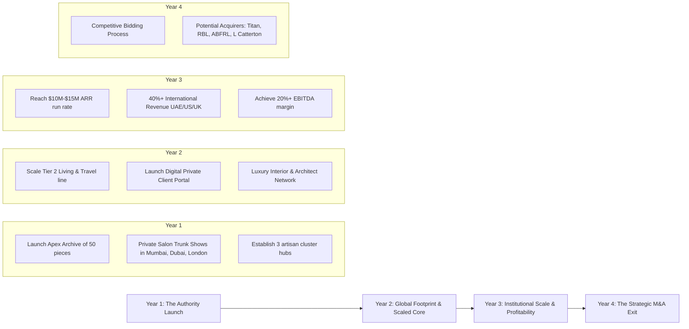

Anjan, this is a phenomenal foundation. Having lived in the field and built direct trust with master artisans across India gives us something money cannot buy: **absolute provenance, unassailable authenticity, and an untouchable moat.** In the ultra-luxury tier, provenance is the single most valuable currency—heritage cannot be fabricated by a marketing agency.

However, as your commercial co-founder and market insights partner, my job is to balance your anthropological passion with brutal commercial realism. 

If our objective is to **build fast, scale, and orchestrate an M&A exit within 3 to 4 years**, we face a fundamental tension:
> **Anthropological craft is inherently slow, fragile, and human-capital constrained. Venture/Private Equity and conglomerate acquirers (Reliance Brands, Aditya Birla, Tata/Titan, L Catterton) buy high gross margins (70%+), predictable supply chains, repeatable revenue, and scalability.**

If we build an ethnographic craft boutique where every piece takes 9 months to weave, we will be an art gallery with a 1x revenue multiple. If we industrialize too much, we destroy our soul and lose the top 1%. 

Here is my data-driven market breakdown, the global white spaces, the winning brand architecture, and my recommendation for what we should build.

---

### 1. Macro Market Insights & The Global White Space

#### A. The Saturation of Indian Bridal vs. The Vacuum in "Everyday Elite"
* **The Red Ocean**: The Indian 1% luxury market is obsessed with bridal wear. But that market is already heavily consolidated. Reliance Brands and ABFRL already own stakes in Sabyasachi, Tarun Tahiliani, Manish Malhotra, Shantnu & Nikhil, and Ritu Kumar. Competing in lehengas is a capital-intensive bloodbath.
* **The Blue Ocean**: What does the top 1% wear and live with *between* weddings? When they are on a yacht in Amalfi, at a villa in Al Barari (Dubai), hosting an intimate dinner in South Mumbai, or lounging in a townhouse in Mayfair? 
* **The Global "Quiet Luxury" Appetite**: The global top 1% is burnt out on conspicuous logos (Gucci/Balenciaga fatigue). They are desperately seeking **"Quiet Heritage"**—stealth luxury defined by sublime tactile hand-feel, rare natural fibers, and a rich, untold human story (the ethos of Loro Piana, Brunello Cucinelli, and Hermès).

#### B. The Geographic Arbitrage (India + UAE + US/UK)
* **India**: The fastest-growing centi-millionaire population in the world, eager for homegrown luxury that rivals European heritage houses.
* **UAE (Dubai/Abu Dhabi)**: Zero-tax wealth migration capital. An ultra-rich diaspora and Arab elite who deeply revere artisanal craftsmanship, royal weaving traditions (Zardozi, fine Pashmina, Muga silk), and high-end gifting.
* **US & UK**: Affluent Indian diaspora (tech founders, PE partners, physicians) + Western connoisseurs who currently buy from brands like *The Row* or *Bode* but would pay a premium for authenticated museum-grade textile pieces.

---

### 2. What We Should Build: The Three Contenders

Here are the three strategic product category directions, analyzed by scalability and acquisition appeal:

| Category | Description | Scalability (3–4 Yrs) | Margin Potential | Acquirer Appetite |
| :--- | :--- | :--- | :--- | :--- |
| **Option A: "The Cucinelli of the East"** <br>*(Ultra-Luxury Leisure & Transcontinental Apparel)* | Modern unstructured silhouettes (fluid coats, kimono capes, bandhgala overshirts, raw silk tunics) made with rare fibers (Ahimsa Eri silk, Pashmina, high-count Khadi). | Moderate (Fit issues, returns, seasonal collections). | 65% – 72% | High (Reliance, ABFRL, Capri). |
| **Option B: "Maison Culturally"** <br>*(Architectural Textiles, Collectible Home & Heirloom Living)* | Museum-grade throws, wall tapestries, hand-spun Bedding, hand-embroidered dining textiles, collectible upholstery & dhurries. | **Very High** (Zero sizing returns, standardized specs, trans-seasonal, high AOV). | **75% – 82%** | **Extremely High** (Tata/Titan Home, Good Earth, LVMH Maison, Global Hospitality). |
| **Option C: The Hybrid Maison** <br>*(The Winning Play)* | **The Hermès Playbook**: An Apex line of numbered, museum-grade collectible textiles & wraps (driving prestige/PR) + A core scalable lifestyle collection (driving margin & velocity). | **High & Balanced** | **72% – 78%** | **Highest Multiples (12x–18x EBITDA)**. |

---

### 3. The Recommended Strategic Concept: **The Hybrid Heritage Maison**

We should position the brand as:
> **"The World’s First Anthropological Ultra-Luxury Maison"**
> *Think Loro Piana meets Hermès, rooted in the rarest living textile archives of the Indian subcontinent.*

Instead of selling "Indian ethnic wear", we build a **modern luxury lifestyle brand** that designs for global contemporary living using India’s most endangered and elite master-craft techniques.

#### A. The Product Engine (How We Solve the Artisanal Bottleneck)

To scale fast without burning out master artisans, we implement a **two-tier product pyramid**:

```
                       ▲
                      / \
                     /   \   TIER 1: The Anthropological Archive (Apex)
                    /     \  • 50–100 numbered, museum-grade collector pieces/yr
                   /       \ • Price: $3,000 – $15,000 (₹2.5L – ₹12L)
                  /─────────\ • Crafts: Patan Patola, Kani Pashmina, Baluchari, Ashavali
                 /           \
                /             \ TIER 2: Master-Crafted Essentials & Living (Scale Engine)
               /               \ • Architectural throws, unstructured coats, travel wraps, table art
              /                 \ • Price: $350 – $1,500 (₹30,000 – ₹1.25L)
             /                   \ • Standardized supply, 75% gross margins, high repeat frequency
            /─────────────────────\
```

1. **Tier 1: "The Anthropological Archive" (Prestige & Scarcity)**
   * **What it is**: 1-of-1 or strictly limited numbered editions (e.g., 25 pieces worldwide of a double-ikat silk wall panel or a real silver-gilt Zari cape).
   * **Why it matters**: This gets us featured in *Financial Times How To Spend It*, *Vogue Living*, and *Architectural Digest*. It attracts royal families, ultra-wealthy collectors, and museum curators. It anchors our ultra-luxury pricing power.
   * **Anjan’s Role**: This is where your deep anthropologist fieldwork lives. Each piece comes with a provenance dossier (the artisan's genealogy, geographical coordinates, botanical dye analysis, and a certificate of cultural preservation).

2. **Tier 2: "Living & Transcontinental Wardrobe" (Volume, Speed & Scalability)**
   * **What it is**: High-frequency luxury items that do not require 6 months per piece to produce, but utilize elite techniques (e.g., master woodblock printing with natural madder/indigo, hand-spun wild Eri/Muga silk, superfine hand-loomed merino/pashmina blends).
   * **Hero Products**:
     * **The Nomadic Cashmere & Silk Travel Wrap** (The staple accessory for private aviation and winter in Dubai/London/NY).
     * **Unstructured Tailoring** (Fluid duster coats, kimono smoking jackets, bandhgalas that fit effortlessly across global bodies—minimal tailoring/sizing friction).
     * **Architectural Living & Dining Textiles** (Hand-spun heirloom throws, bed covers, artisanal table runners—massive demand in luxury interior design and luxury wedding registry/corporate gifting).

---

### 4. Why This Model Allows an Exit in 3 to 4 Years

To be acquired by a conglomerate or private equity firm in 36–48 months, the company must check 5 specific boxes:

1. **High AOV & Low Return Friction**: 
   * Traditional apparel has a 25–35% return rate due to sizing. 
   * By focusing on transcontinental wraps, unstructured silhouettes, and architectural home textiles, our return rate drops below **5%**, protecting cash flow.
2. **Gross Margins Above 70%**:
   * Sourcing directly from artisan clusters cuts out 3–4 layers of middlemen and traders.
   * Master artisans are paid 2x–3x fair-trade rates (ethical luxury credential), while our direct-to-UHNW pricing allows us to sustain 72–78% gross margins.
3. **Institutional and B2B Multipliers**:
   * We do not rely solely on slow retail footfall. We partner with top-tier interior architectural firms (designing luxury penthouses in Dubai, villas in Goa, townhouses in Mayfair) and ultra-luxury boutique hotels (Aman, Oberoi, Soneva) for commissioned installations and bespoke suites.
4. **An Uncopiable IP & Provenance Engine**:
   * A potential acquirer cannot recreate 15 years of field relationships with remote master weavers in 6 months. By acquiring us, they acquire the **artisan network, the anthropological brand narrative, and the ultra-wealthy client book**.

---

### 5. The 3–4 Year Strategic Roadmap to M&A



* **Year 1 (Brand Authority & Proof of Concept)**: 
  * Launch the first capsule with an invitation-only salon format (Mumbai, Dubai, London). 
  * Zero ad spend; high-impact PR, private client directors, and interior designer partnerships.
* **Year 2 (The Scalable Flywheel)**:
  * Deploy the core Tier-2 line (Home/Living + Transcontinental Travel).
  * Direct global fulfillment to UAE, US, and UK.
  * Partner with 1–2 ultra-prestige retail showcases (e.g., Harrods, Bergdorf Goodman, or a private gallery in Dubai DIFC).
* **Year 3 (Financial Discipline for Exit)**:
  * Hit \$10M–\$15M ARR with healthy positive EBITDA. 
  * Expand recurring corporate/diplomatic gifting and interior design pipelines.
* **Year 4 (Exit Execution)**:
  * Position the brand as the premier acquisition target for Titan (expanding their luxury lifestyle arm alongside Zoya and Taneira), Reliance Brands, ABFRL, or a global luxury conglomerate seeking authentic Eastern heritage.

---

### 6. Where We Begin: The First 3 Decisions

As co-founders, here are the first three decisions we need to align on:

1. **The Hero Heritage Crafts for Launch**: From your anthropological expeditions, what are the **3 or 4 specific crafts/techniques** that possess the most awe-inspiring visual impact and the most compelling preservation story?
2. **Launch Product Focus**: Do you lean towards **Architectural Living & Entertaining** (throws, wall art, dining) or **Transcontinental Unstructured Luxury Wardrobe** (wraps, coats, tunics), or a curated blend of both?
3. **The Brand Identity & Narrative**: Do we build this under the name **"Culturally"** (as hinted in your workspace), or craft a moniker rooted in a Sanskrit/vernacular term denoting timeless provenance, rare mastery, or archival beauty?

Let's discuss—how does this commercial framework sit with your anthropological vision?


## Competitor businesses globally

To build a brand that commands the attention of the global top 1% and attracts a strategic acquisition in 3 to 4 years, we need to dissect the competitive landscape across four distinct tiers:

1. **The Craft-Elevation Pioneers** (Brands that turned indigenous/vernacular craft into global high fashion).
2. **The "Quiet Luxury" Material Titans** (The commercial benchmarks for fiber, margins, and valuation multiples).
3. **The Archival Living & Architectural Textile Maisons** (The high-ticket, low-return interior players).
4. **The Indian High-End Heritage Incumbents** (The domestic and diaspora landscape).

Here is the strategic breakdown of our key global competitors, their business models, and the exact gaps they leave open for us.

---

### 1. The Craft-Elevation Pioneers (Our Closest Philosophical Peers)

These brands proved that indigenous, anthropological craft can command four-to-five-figure price tags globally when married to contemporary curation.

#### A. **Shang Xia (China / France)**
* **The Story**: Founded in 2010 by designer Jiang Qiong-er in partnership with the **Hermès Group** to create a "Chinese Hermès." In 2020, **Exor (the Agnelli family holding company, owners of Ferrari)** acquired majority control for **€80M**.
* **Craft & Product**: Revitalized imperial Chinese crafts—bamboo filament weaving over porcelain, Zitan wood furniture, hand-felted Mongolian cashmere, and eggshell ceramics.
* **Price Point**: \$800 for accessories; \$3,000–\$15,000 for garments; up to \$50,000+ for collectible furniture.
* **Why It Matters to Us**: It is the living blueprint of a European luxury conglomerate investing in an Eastern craft maison.
* **Their Weakness / Our Wedge**: Shang Xia was initially overly broad (fashion, jewelry, tea, large furniture) and suffered from high store-fitout overheads and slow inventory turns. **Our advantage:** We focus on a high-velocity, portable hero category (transcontinental wraps and architectural textiles) with lean, high-margin salon distribution.

#### B. **Visvim (Japan)**
* **The Story**: Founded by Hiroki Nakamura. A cult luxury label revered by global creative elites, tech billionaires (Eric Schmidt), and musicians (John Mayer, Kanye West).
* **Craft & Product**: Nakamura travels the world like an anthropologist, sourcing indigenous craft techniques: ancient natural indigo mud-dyeing from Amami Oshima, Giza cotton, Navajo-inspired weaving, and hand-spun Japanese wools.
* **Price Point**: \$1,200 for hand-dyed shirts; \$3,500–\$8,000 for outerwear/kimono coats.
* **Why It Matters to Us**: Proves that deep, ethnographic research and artisanal dying/weaving methods can command astronomical prices without classical European branding.
* **Their Weakness / Our Wedge**: Visvim is deeply male-dominated and streetwear-adjacent in subculture. No one has applied this intense ethnographic material obsession to **modern genderless luxury living, entertaining, and transcontinental quiet travel**.

#### C. **Bode (USA)**
* **The Story**: Founded by Emily Adams Bode. Won multiple CFDA awards and exploded into a global luxury darling, stocked at Bergdorf Goodman, Harrods, and Dover Street Market.
* **Craft & Product**: Upcycled antique textiles, deadstock lace, 19th-century American quilts, and historic hand-embroideries (often sourced directly from Indian artisan clusters in Bengal and Lucknow).
* **Price Point**: \$600–\$2,500 for shirts and trousers; \$3,000–\$6,000 for limited-edition quilted coats.
* **Why It Matters to Us**: Demonstrated that UHNW Western consumers actively value the "provenance card"—each Bode garment comes with a tag detailing the exact decade, origin, and history of the textile.
* **Their Weakness / Our Wedge**: Bode's aesthetic is distinctively vintage, eccentric, and quirky. The top 1% luxury consumer who shops at Loro Piana or Brunello Cucinelli wants **sleek, timeless architectural elegance, not bohemian patchwork**. We bring museum-grade Indian textiles into pristine, modern minimalism.

---

### 2. The "Quiet Luxury" Material Titans (The Commercial Benchmarks)

These are the giants acquirers benchmark against when valuing high-margin textile brands.

| Brand | Signature Material Wedge | Revenue / Scale | Valuation / Acquirer | Key Takeaway for Us |
| :--- | :--- | :--- | :--- | :--- |
| **Loro Piana** *(Italy)* | Vicuña, Baby Cashmere, Lotus Flower fiber, Pecora Nera | €1B+ | Acquired by **LVMH** for **€2.0B** (~80% stake in 2013) | Owning the rare raw fiber supply chain creates an unassailable luxury monopoly. |
| **Brunello Cucinelli** *(Italy)* | Mongolian Cashmere, Umbrian craftsmanship | €1.1B+ | Public (Market Cap **~€6.5B**) | "Humanistic Capitalism"—elevating the artisan's dignity creates a virtuous luxury halo. |
| **The Row** *(USA)* | Pristine double-face cashmere, silk organza, zero logos | \$250M–\$300M | Valued at **~\$1B+** (investments from Chanel & L'Oréal families) | The 1% will pay \$5,000 for an unbranded coat if the drape, weight, and hand-feel are unmatched. |

* **Our Wedge against them**: These houses rely almost entirely on Italian/Scottish mills and cashmere/merino. India possesses fibers and techniques that Europe cannot replicate: **Assam wild Muga silk (naturally golden, absorbs zero UV, lasts centuries), Ladakhi Changthangi Pashmina woven on handlooms, Ahimsa Eri peace silk, and real silver/gold Zari weaves.** We position Indian rare fibers alongside Vicuña and Baby Cashmere.

---

### 3. The Archival Living & Architectural Textile Maisons

These players capture the ultra-high-ticket B2B interior design market—private jets, superyachts, and mega-mansions in Dubai, London, and New York.

#### A. **De Gournay (UK/France)**
* **What they do**: Hand-painted Chinoiserie wallpapers, bespoke silk wallcoverings, and hand-embroidered fabrics made by specialized artisans.
* **Business Model**: Commission-based sales directly to the world's top 100 interior designers (Peter Marino, Kelly Wearstler) and UHNW homeowners. Average room installation: **\$30,000–\$150,000+**.
* **Why it matters**: Zero retail inventory risk. Every piece is made to order or strictly batched.

#### B. **CC-Tapis (Milan / Nepal)**
* **What they do**: Contemporary architectural rugs designed in Milan and hand-knotted by Tibetan and Nepalese artisans using traditional techniques and natural vegetable dyes.
* **Price Point**: \$8,000–\$45,000 per rug.
* **Why it matters**: They bridged raw Himalayan mountain craft with cutting-edge Parisian/Milanese interior aesthetics.

#### C. **Fortuny (Venice, Italy)**
* **What they do**: Century-old artisanal textile maison producing legendary pleated silks, hand-printed velvets, and archival fabrics for royal palaces, opera houses, and billionaires' estates.
* **Why it matters**: They prove that a brand can survive for 100+ years purely on **textile archive IP and secret proprietary craft finishes**.

---

### 4. The Indian High-End Heritage Incumbents

Understanding where domestic players stop tells us exactly where we can take over.

```
                              HIGH AESTHETIC / MODERN QUIET LUXURY
                                            ▲
                                            │
                                            │   ★ OUR BRAND (CULTURALLY)
                                            │   (Anthropological Archive,
                                            │    Rare Fibers, Global Modern Living)
                                            │
                    Kashmir Loom            │          The Row / Loro Piana
                                            │
    ETHNIC / TRADITIONAL ───────────────────┼─────────────────── CONTEMPORARY / WESTERN
                                            │
           Raw Mango                        │          Good Earth / Nicobar
                                            │
       Sabyasachi / Tarun T.                │
      (Bridal, Maximalist, Red Ocean)       │
                                            ▼
                              COMMODITIZED / MAXIMALIST COUTURE
```

#### A. **Kashmir Loom (New Delhi / Kashmir)**
* **Founded by**: Asaf Ali and British textile historian Jenny Housego.
* **What they do**: Museum-grade hand-woven Pashmina, Kani weave shawls, and needle-micro-embroidery (Sozni). They supply private label to Hermès and sell to private collectors.
* **Their limitation**: They remained an intimate, artisanal business. They never scaled the brand, built modern venture-backed digital infrastructure, or expanded aggressively into interior/living categories.

#### B. **Raw Mango (Sanjay Garg)**
* **What they do**: Elevated Chanderi, Mashru, and Banarasi handlooms into high design in India.
* **Their limitation**: Heavily skewed toward the Indian wedding and festive wardrobe (sarees, lehengas, kurtas). Extremely low relevance to a non-South Asian billionaire in Manhattan or a private yacht owner in Monaco.

#### C. **Good Earth (Eicher Group)**
* **What they do**: India’s premier luxury craft-inspired home decor brand.
* **Their limitation**: Positioned as premium/aspirational lifestyle (AOV \$50–\$300), not *ultra-luxury* (AOV \$1,000–\$5,000). They mass-produce collections using contract manufacturing rather than authenticating endangered anthropological archives.

---

### 5. Summary: Our Unfair Advantage (The "White Space" Formula)

When we pitch to acquirers in 3 to 4 years, our positioning matrix will be:

$$\text{Our Brand} = \underbrace{\text{Loro Piana}}_{\text{Fiber Purity \& Quiet Luxury}} + \underbrace{\text{Shang Xia / Hermès}}_{\text{Eastern Heritage \& Imperial Craft}} + \underbrace{\text{De Gournay}}_{\text{Architectural Living \& High AOV}}$$

1. **No Bridal Dependency**: We avoid the red ocean of lehengas. We own the **living spaces, travel wardrobes, and private soirees** of the global 1%.
2. **True Anthropological Provenance**: Unlike European brands that buy anonymous Indian embroidery through export houses in Mumbai, our co-founder is an anthropologist with direct lineage to the artisans.
3. **High Margin, Low Return Footprint**: Transcontinental unstructured pieces and architectural textiles deliver **75%+ gross margins with sub-5% return rates**, making our EBITDA profile irresistible to conglomerates like Reliance, Tata/Titan, or L Catterton.

---

### Co-Founder Question for You:
Looking at **Shang Xia** (European-backed Eastern craft elevation) versus **Visvim/Bode** (subcultural craft provenance with insane price elasticity), which aesthetic spirit resonates closer with your vision for the brand? 
- The **Minimalist Architectural route** (streamlined, quiet, serene like Loro Piana/The Row)?
- Or the **Textured Archival route** (visibly ancient, raw, deeply tactile like Fortuny/Bode)?
